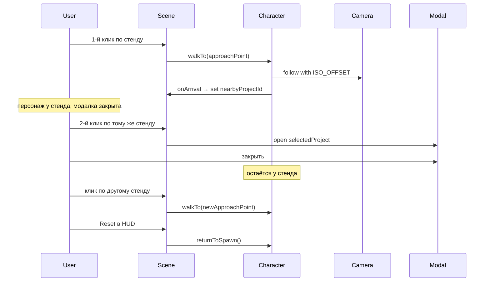

# План рефакторинга: персонаж, открытый мир, чистая изометрия

> **Для агента / разработчика:** этот документ — согласованный план доработки портфолио Niperx.
> Реализация **ещё не начата** (на момент сохранения). Читай целиком перед работой.
> Статус задач: все пункты в секции «Чеклист» — `pending`.

**Дата плана:** 2026-06-29  
**Ветка / коммит:** сохранено из сессии планирования в Cursor

---

## Кратко: что решили

| Тема | Решение |
|------|---------|
| Камера | Только фиксированная изометрия, следует за персонажем. **Orbit и другие режимы — удалить полностью** |
| Персонаж | Всегда видим на сцене (может перекрываться объектами) |
| Клик по стенду | **Два клика:** 1-й — идти к стенду; 2-й (когда рядом) — открыть модалку |
| После закрытия модалки | Персонаж **остаётся** у стенда |
| Reset в HUD | Телепорт персонажа на спавн |
| Окружение | Открытое пространство **без стен**, маленькая студия на 6–8 проектов + декор |
| MiniTelegramBot | **Убрать** из модалки и сцены сейчас; файл `src/components/bot/MiniTelegramBot.tsx` оставить |
| Pathfinding | Не нужен в v1 — открытый пол, движение по прямой (GSAP) |
| Визуал | Светлая сцена, чёрные объекты (уже сделано в коде до этого плана) |

---

## Текущее состояние кода (до реализации плана)

Уже сделано в репозитории:

- Светлая ч/б тема: белый фон, чёрные 3D-объекты (`src/utils/colors.ts`, `src/index.css`)
- Ортографическая камера, flat shading, без теней (`src/components/scene/Scene.tsx`)
- 6 проектов в `src/data/projects.ts`, low-poly стенды без TG-чата в сцене
- Zustand store, LoadingScreen, HUD, модалка, mobile 2D gallery

**Ещё в коде (нужно убрать по плану):**

- `OrbitControls`, `controlMode` explore/orbit
- Камера летит к проекту при клике (вместо персонажа)
- Стены «комнаты» в `IsoStudio`
- `MiniTelegramBot` в `ProjectModal`
- Мёртвые deps: `@react-three/postprocessing`, `postprocessing`
- README описывает старую концепцию

---

## Чеклист реализации

- [ ] **character-core** — `IsoCharacter`, `CharacterController`, `SPAWN_POINT` / `getApproachPoint`, store: `walkTarget`, `isWalking`, `nearbyProjectId`, удалить `controlMode`
- [ ] **camera-follow** — `NavigationController`: камера следует за персонажем, удалить `OrbitControls` и fly-to-project
- [ ] **click-flow** — `useProjectObject`: два клика; HUD: убрать Orbit, подсказки, reset-to-spawn
- [ ] **open-world** — `IsoStudio`: без стен, пол ~16×16, новый `SketchDecor` (костёр, реквизит, sketch-элементы)
- [ ] **ui-cleanup** — светлая `ProjectModal`, убрать `MiniTelegramBot`, удалить postprocessing deps, обновить README

---

## Целевой UX-поток (два клика)



### Логика клика (`useProjectObject`)

```
onClick(project):
  if isWalking → ignore

  if isNear(project) && nearbyProjectId === project.id:
    → setSelectedProject(project)   // открыть модалку

  else:
    → walkToProject(project)        // идти к стенду
```

`isNear(project)` — дистанция персонажа до `getApproachPoint(project.position)` < порог (~0.35–0.5).

---

## Фаза 1 — Персонаж и камера (ядро)

### 1.1 Новый компонент персонажа

Создать `src/components/scene/character/IsoCharacter.tsx`:

- Минималистичный low-poly силуэт: цилиндр тело + сфера голова + 2 «ноги», всё чёрное (`OBJECT.fill`)
- Лёгкий walk-bob при движении (`useFrame`)
- Поворот по направлению движения (`rotation.y`)

### 1.2 Точка спавна и подхода

Добавить `src/utils/navigation.ts` (или расширить `src/utils/isometric.ts`):

```ts
export const SPAWN_POINT = new THREE.Vector3(0, 0, 2);

export function getApproachPoint(projectPos: [number, number, number]): THREE.Vector3 {
  // вектор от стенда к спавну, offset ~1.0–1.2 — персонаж встаёт «перед» объектом
}
```

Опционально позже: поле `approachOffset` в `src/types/project.ts`.

### 1.3 Рефактор Zustand

В `src/hooks/usePortfolioStore.ts`:

- **Удалить:** `controlMode`, `setControlMode`, тип `ControlMode`
- **Переименовать:** `travelTarget` → `walkTarget`, `isTraveling` → `isWalking`
- **Добавить:** `nearbyProjectId: number | null`
- Позиция персонажа — ref в `CharacterController` (+ экспорт позиции для `isNear`)
- `walkToProject(project)` — цель, сброс `nearbyProjectId`, блок кликов при `isWalking`
- `completeWalk()` — **не открывает модалку**; `nearbyProjectId = walkTarget.id`
- `resetView()` — спавн, `nearbyProjectId = null`, сброс камеры

### 1.4 CharacterController

Создать `src/components/scene/character/CharacterController.tsx`:

- Слушает `walkTarget`
- GSAP движение (`power2.inOut`, ~1.2–1.8с)
- `onComplete` → `completeWalk()` (без модалки)
- Опционально: visual cue у стенда при `nearbyProjectId`
- Рендерит `IsoCharacter`

### 1.5 NavigationController

В `src/components/scene/NavigationController.tsx`:

- Удалить `OrbitControls`, `controlsRef`, `isOrbit`, fly-to-project камеры
- `useFrame`: `camera.position = characterPos + ISO_OFFSET`, `camera.lookAt(...)`
- Intro и Reset синхронизировать с персонажем

#### Чеклист удаления Orbit

| Файл | Что убрать |
|------|------------|
| `src/components/scene/NavigationController.tsx` | `OrbitControls`, orbit-режим |
| `src/hooks/usePortfolioStore.ts` | `ControlMode`, `controlMode`, `setControlMode` |
| `src/components/ui/HUD.tsx` | Кнопка Orbit/Explore, иконки, подсказки |
| `src/hooks/useProjectObject.ts` | Ветка `controlMode === 'orbit'` |
| `src/App.tsx` | `setControlMode('explore')` |
| `README.md` | Упоминания Orbit |

Подключить в `src/components/scene/Scene.tsx`:

```tsx
<CharacterController />
<NavigationController />
```

### 1.6 Клик по проекту

В `src/hooks/useProjectObject.ts`:

- Убрать orbit
- Рядом + тот же проект → `setSelectedProject`
- Иначе → `walkToProject`
- `isCharacterNearProject()` в `src/utils/navigation.ts`

---

## Фаза 2 — Открытое окружение

### 2.1 IsoStudio

В `src/components/scene/IsoStudio.tsx`:

- Удалить заднюю и боковые стены
- Пол ~16×16, бумажная текстура, едва заметная сетка
- Низкие платформы под проектами
- Лёгкий fog

### 2.2 Декорации

В `src/components/scene/sketch/SketchDecor.tsx`:

- Spawn: костёр / лампа
- Периметр: монитор, книги, карандаши
- Воздух: 2–3 sketch-элемента (линии, заметки)
- Неинтерактивные, не блокируют проход

### 2.3 Проекты

Проверить `position` в `src/data/projects.ts` под новый размер пола.

---

## Фаза 3 — UI, cleanup, docs

### 3.1 HUD

- Убрать Orbit/Explore
- Подсказки: «Клик — подойти»; при `nearbyProjectId` — «Кликните ещё раз»
- Reset — «Вернуться на спавн»

### 3.2 ProjectModal

- Убрать `MiniTelegramBot`
- Светлая тема: `text-mono-*` вместо `text-white` / `text-slate-*`
- Overlay: `bg-black/40`

### 3.3 Прочее

- `App.tsx`: убрать `setControlMode`
- `package.json`: удалить postprocessing deps
- `README.md`: актуализировать

---

## Что НЕ делаем в этом этапе

- MiniTelegramBot в модалке (отложено)
- Pathfinding / коллизии
- `renderOrder` для персонажа (опционально позже)
- Авто-возврат на спавн после закрытия модалки
- Авто-открытие модалки по прибытии

---

## Порядок реализации

1. Store + navigation utils + CharacterController + IsoCharacter
2. NavigationController (camera follow) + удаление Orbit
3. useProjectObject + HUD
4. IsoStudio open world + декор
5. ProjectModal + cleanup deps/README

## Риски

| Риск | Митигация |
|------|-----------|
| Камера дёргается | GSAP персонажа и lookAt в одном timeline |
| Персонаж в геометрии стенда | offset в `getApproachPoint` |
| Mobile 3D тормозит | DPR снижен в `useDevice`; декор `minimal` на mobile |

---

## Контекст обсуждения (для Grok / другого агента)

Обсуждались варианты: floating label vs модалка, один клик vs два, orbit vs только изометрия, комната vs открытый мир, MiniTelegramBot в сцене vs в модалке vs нигде.

**Финальные ответы владельца проекта:**

1. Персонаж всегда видим; модалка при **повторном клике** когда рядом; анимированный подход к стенду — суть взаимодействия
2. Маленькая студия 6–8 проектов, открытый мир без комнаты, декор (костёр и т.д.)
3. MiniTelegramBot пока не нужен; Three.js + R3F остаются
4. Orbit убрать полностью — других видов камеры не будет
5. После закрытия модалки персонаж остаётся у стенда
